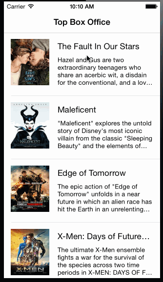
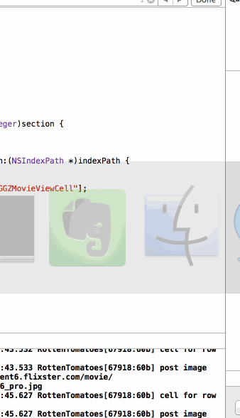

ios_rotten_tomatoes
===================

A simple iOS app that lists movies from Rotten Tomatoes

Requirements
============

Overview
--------
Build a Rotten Tomatoes app to show top movies in theatre. It also shows movie details when a user selects a movie of interest.

User Stories
------------

### Finished Stories

* User can view a list of movies from Rotten Tomatoes.  Poster images must be loading asynchronously.
* User can view movie details by tapping on a cell
* User sees loading state while waiting for movies API.  You can use one of the 3rd party libraries here. (Using [MBProgessHD](https://github.com/jdg/MBProgressHUD) 
* User sees error message when there's a networking error.  You may not use UIAlertView to display the error.  See this screenshot for what the error message should look like: network error screenshot.
* User can pull to refresh the movie list.
* Customize the navigation bar. (optional)
* Must use Cocoapods.
* Asynchronous image downloading must be implemented using the UIImageView category in the AFNetworking library.

### Unfinished Stories

* All images fade in (optional)
* For the large poster, load the low-res image first, switch to high-res when complete (optional)
* All images should be cached in memory and disk. In other words, images load immediately upon cold start (optional).
* Customize the highlight and selection effect of the cell. (optional)
* Add a tab bar for Box Office and DVD. (optional)
* Add a search bar. (optional)

Total Hours Spent: 10 hrs
-------------------------

Screencast
----------

### Normal Flow

Show a list of top movies in theatre, to show movie details by selecting one of them.

### Error Handling

App starts up without network connection, shows a dropdown animated error message about connection error. After network recovers, pull down to refresh and the movie list shows up again.

Credits and Special Thanks
--------------------------

* [Cocoapods](http://cocoapods.org) and [Cocoapods XCode Plugin](https://github.com/kattrali/cocoapods-xcode-plugin)
* [AFNetworking](http://afnetworking.com) and [a great tutorial by Ray Wenderlich](http://www.raywenderlich.com/59255/afnetworking-2-0-tutorial)
* [MBProgessHUD Cocoa Control for showing loading status](https://github.com/matej/MBProgressHUD)
* Shamelessly borrowed error message code from [the article: SnapChat style error message](https://teamtreehouse.com/forum/snapchat-style-error-messages)
